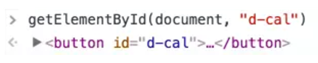
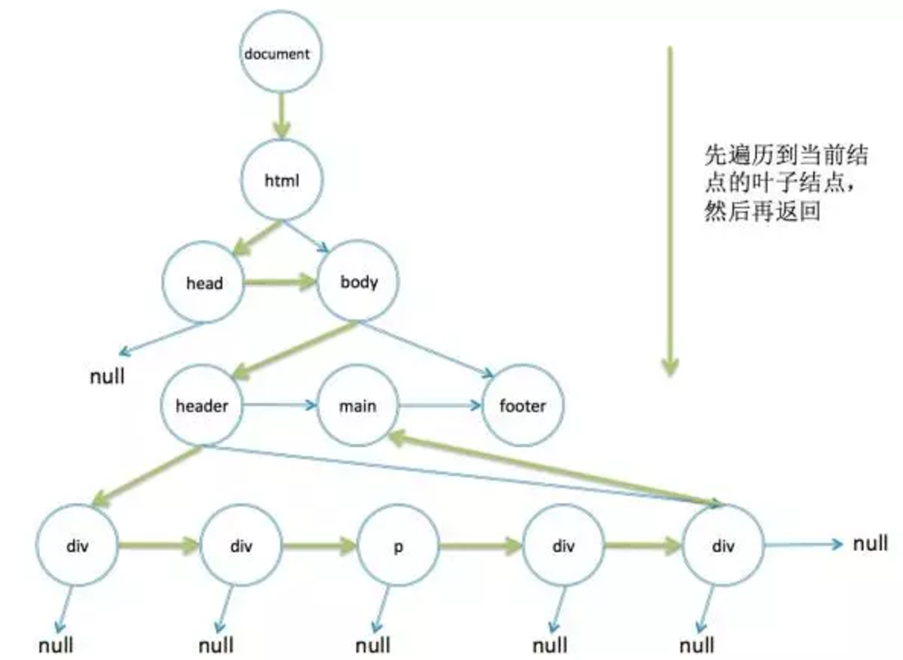

## 1. 递归

递归就是自己调自己，递归在前端里面算是一种比较常用的算法。假设现在有一堆数据要处理，要实现上一次请求完成了，才能去调下一个请求。一个是可以用Promise，就像《前端与SQL》这篇文章里面提到的。但是有时候并不想引入Promise，能简单处理先简单处理。这个时候就可以用递归，如下代码所示：

```javascript
var ids = [34112, 98325, 68125];
(function sendRequest(){
    var id = ids.shift();
    if(id){
        $.ajax({url: "/get", data: {id}}).always(function(){
            //do sth.
            console.log("finished");
            sendRequest();
        });
    } else {
        console.log("finished");
    }
})();
```
上面代码定义了一个sendRequest的函数，在请求完成之后再调一下自己。每次调之前先取一个数据，如果数组已经为空，则说明处理完了。这样就用简单的方式实现了串行请求不堵塞的功能。

再来讲另外一个场景：DOM树。

由于DOM是一棵树，而树的定义本身就是用的递归定义，所以用递归的方法处理树，会非常地简单自然。例如用递归实现一个查DOM的功能document.getElementById。

```javascript
function getElementById(node, id){
    if(!node) return null;
    if(node.id === id) return node;
    for(var i = 0; i < node.childNodes.length; i++){
        var found = getElementById(node.childNodes[i], id);
        if(found) return found;
    }
    return null;
}
getElementById(document, "d-cal");
```
document是DOM树的根结点，一般从document开始往下找。在for循环里面先找document的所有子结点，对所有子结点递归查找他们的子结点，一层一层地往下查找。如果已经到了叶子结点了还没有找到，则在第二行代码的判断里面返回null，返回之后for循环的i加1，继续下一个子结点。如果当前结点的id符合查找条件，则一层层地返回。所以这是一个深度优先的遍历，每次都先从根结点一直往下直到叶子结点，再从下往上返回。

最后在控制台验证一下，执行结果如下图所示：



使用递归的优点是代码简单易懂，缺点是效率比不上非递归的实现。Chrome浏览器的查DOM是使用非递归实现。非递归要怎么实现呢？

如下代码：

```javascript
function getByElementId(node, id){
    //遍历所有的Node
    while(node){
        if(node.id === id) return node;
        node = nextElement(node);
    }
    return null;
}
```

还是依次遍历所有的DOM结点，只是这一次改成一个while循环，函数nextElement负责找到下一个结点。所以关键在于这个nextElement如何非递归实现，如下代码所示：

```javascript
function nextElement(node){
    if(node.children.length) {
        return node.children[0];
    }
    if(node.nextElementSibling){
        return node.nextElementSibling;
    }
    while(node.parentNode){
        if(node.parentNode.nextElementSibling) {
            return node.parentNode.nextElementSibling;
        }
        node = node.parentNode;
    }
    return null;
}
```

还是用深度遍历，先找当前结点的子结点，如果它有子结点，则下一个元素就是它的第一个子结点，否则判断它是否有相邻元素，如果有则返回它的下一个相邻元素。如果它既没有子结点，也没有下一个相邻元素，则要往上返回它的父结点的下一个相邻元素，相当于上面递归实现里面的for循环的i加1.

在控制台里面运行这段代码，同样也可以正确地输出结果。不管是非递归还是递归，它们都是深度优先遍历，这个过程如下图所示。
